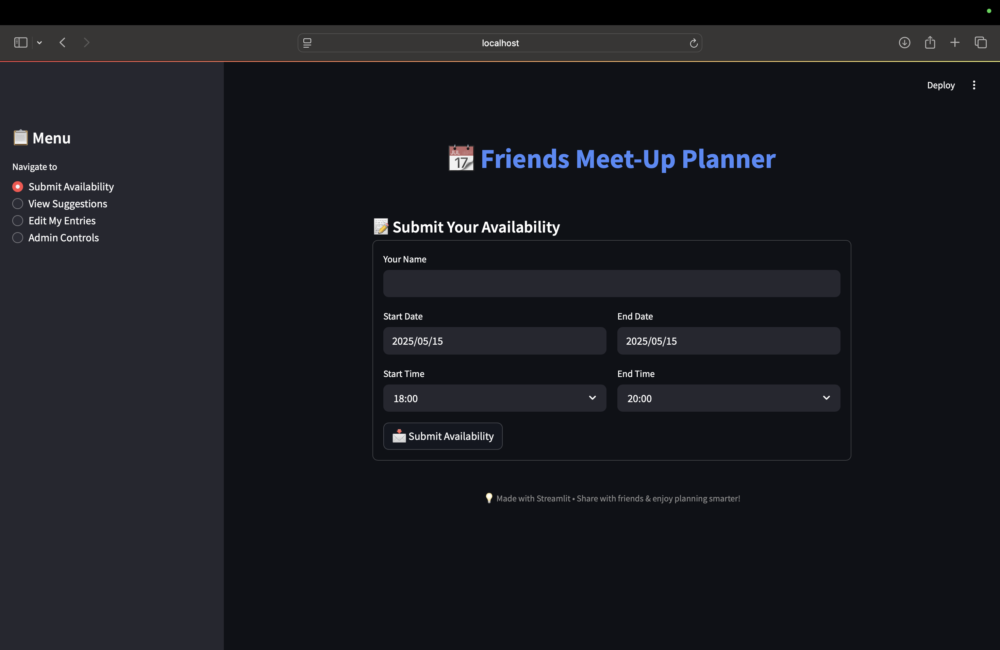

# 📆 Meet-Up Planner

A simple Streamlit app to help groups of friends coordinate availability and suggest the best dates to meet up. Users can submit availability, edit their entries, and view the most popular suggested dates. Admins can clear data with a secure passcode.




---

## 🚀 Features

- 📝 **Submit Availability**: Enter your name and choose your available dates and time slots.
- ✏️ **Edit My Entries**: Modify or delete your previous submissions.
- 📅 **View Suggestions**: See the most popular dates based on all availability data.
- 🔒 **Admin Controls**: Secure area to clear all data (protected by a passcode).

---

## 🛠️ Tech Stack

- [Python](https://www.python.org/)
- [Streamlit](https://streamlit.io/)
- [Pandas](https://pandas.pydata.org/)

---

## 🧪 How to Run Locally

1. **Clone the repository**:
   ```bash
   git clone https://github.com/YOUR_USERNAME/meetup-planner.git
   cd meetup-planner
   Install dependencies: install -r requirements.txt
   run app: streamlit run app.py
